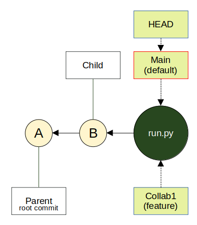
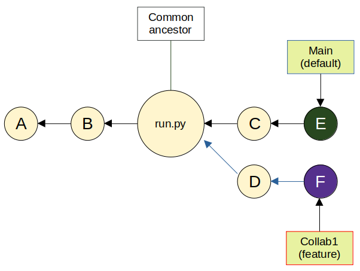
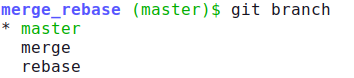
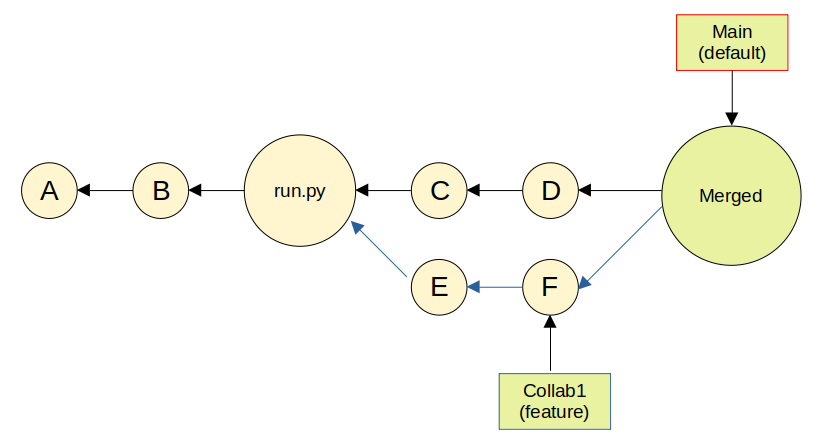
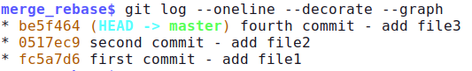
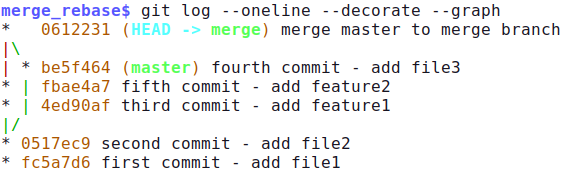
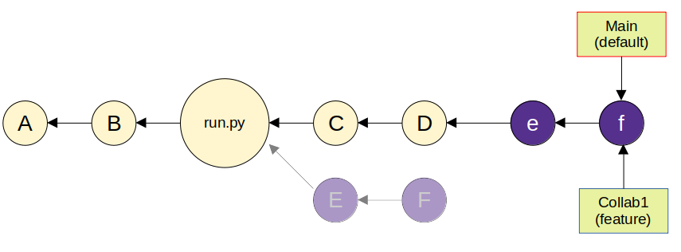
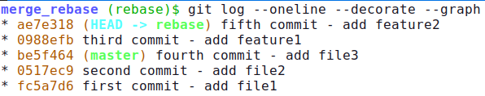
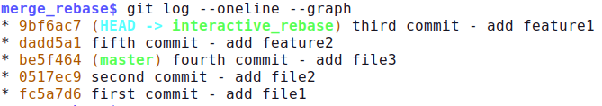

## Git branch
Source: [basic-git-branching](https://git-scm.com/book/en/v2/Git-Branching-Basic-Branching-and-Merging), [how-to-use-branches](https://www.atlassian.com/git/tutorials/using-branches), [branching-in-a-nutshell](https://git-scm.com/book/en/v2/Git-Branching-Branches-in-a-Nutshell), [git-tutorial](https://git-scm.com/docs/gittutorial)

## What is Branch?
* In Git, a branch is a **lightweight, movable pointer to a commit**. When you create a branch, you create a new pointer. The default branch name in Git is master (or main on Github). As you start making commits, you're given a main branch that points to the last commit you made. Every time you commit, the main branch pointer moves forward automatically.
* Instead of copying all files, Git simply tracks where your work diverges from the main line. It represents an independent line of development. Unlike older version control systems, Git does not copy all your files when you create a branch. Instead, it simply remembers which commit you are currently working on. This makes branching in Git  fast and "cheap" in terms of storage. 

<p align="center" width="70%">
     
</p>

The HEAD Pointer: Git uses a special pointer called HEAD to track the current branch you are working on. When switch branches, HEAD moves
to the new branch pointer.
- Efficient Storage: Git only stores the differences between branches. Identical files are shared, meaning branching costs almost no disk 
space and is nearly instantaneous.

## Purpose: Isolation & Safety
The primary goal of branching is isolation. It allows for:

- Independent Development: Changes made in a branch do not affect the main project until they are intentionally merged.
- Stability: The main line of development (usually called main) remains stable and deployable, while experimental or incomplete code is kept separate.
- Risk Management: If a feature or an experiment fails, the branch can be deleted without any impact on the rest of the project.

## The "Feature Branch" Workflow

This is the industry-standard strategy for working in teams:

- Task-Oriented: A dedicated branch is created for every new task (e.g., a new feature, a bug fix, or a UI update).
- Quality Control:  This ensures that the main branch only contains tested, production-ready code.
- Parallel Work: It facilitates collaboration, as multiple developers can work on different tasks simultaneously without interfering with 
each other.

Example:
1. You can always create a branch (Collab1) from an existing branch (main). Main and Collab1 contain the same commits A, B and run.py
2. You can then work on this new branch in isolation from changes that other people are making to the repository and in parallel with others in that repository. Main commits: A, B, run.py, C, and E; Collab1 commits: A, B, run.py, D, and F.

<p align="center" width="70%">
     
</p>


### Essential Commands for Branch Management
`git branch` – Lists all existing branches in the repository

`git branch NAME` – Creates a new branch at the current commit

`git checkout NAME` – Switches the working directory to the specified branch

`git checkout -b NAME` – A combined command to create and switch to a new branch immediately

`git push origin NAME` – Uploads the local branch to a remote server (GitHub)

## Git rebase

Source: [merge-vs-rebase](https://www.atlassian.com/git/tutorials/merging-vs-rebasing), [merge-rebase-pros-and-cons](https://www.datacamp.com/blog/git-merge-vs-git-rebase) [git-merge-history](https://stackoverflow.com/questions/48814114/git-history-for-branch-after-merge), [visualize-git-log](https://redfin.engineering/visualize-merge-history-with-git-log-graph-first-parent-and-no-merges-c6a9b5ff109c)

The first thing to understand about **`git rebase`** is that it solves the same problem as **`git merge`**. Both of these commands are designed to integrate changes from one branch into another branch—they just do it in very different ways.

<p align="left" width="70%">
     
</p>

* **`Git merge`** creates a new commit that combines changes from two branches while preserving the original commit history of both branches. Merge **maintains the chronological timeline of development without altering existing commits** (non-destructive integration), showing when features were actually integrated. This approach shines in collaborative environments where multiple developers work on the same codebase at the same time. You can see exactly when features were developed, who worked on what, and how different branches evolved over time. It preserves valuable context, but also **increases the visual complexity of the project history**.
  
* Git merge presents all **conflicts at once in a single resolution session**. Git identifies every conflicting file and marks all problematic sections at the same time, which allows you to see the complete scope of integration challenges upfront. However, complex merges with many conflicts can become overwhelming. You might find yourself resolving dozens of conflicting files in a single session, making it easy to miss subtle integration issues or introduce new bugs during the resolution process.

<p align="center" width="70%">
     
</p>


Visualize merge in git

<p align="left" width="70%">
     
</p>

<p align="left" width="70%">
     
</p>


* **`Git rebase`**, on the other hand, instead of creating merge commits, rebase **moves your entire feature branch to start from the latest commit of your target branch**. This process involves **historical revision** where Git temporarily removes your commits, updates the base branch, and then reapplies your changes one by one. **Each commit gets a new SHA hash, effectively creating new commits that contain the same changes but with different parent relationships**. Rebase creates a linear, cleaned-up history that appears as if all changes were made sequentially. This approach works exceptionally well for private branches where you're the only developer making changes. However, rebasing public branches on which others have based their work can **create serious coordination problems and duplicate commits in your shared history**. Git will think that your main branch’s history has diverged from everybody else’s; moreover, when you rebase, you're **changing commit SHA hashes**, which means **other developers' branches will no longer have the correct parent commits**. This forces team members to perform complex recovery operations or potentially lose their work when they try to merge their changes. The golden rule of git rebase is to **never use it on public branches**.
  
* Git rebase forces you to resolve conflicts iteratively, one commit at a time, as it replays your branch's history. When conflicts arise during rebase, Git stops at each problematic commit and requires you to **resolve conflicts before continuing to the next commit**. However, rebase's conflict resolution can become tedious for long-running feature branches. You might encounter the same conflict multiple times if similar changes were made across several commits, requiring repeated resolution of essentially identical problems.
 
<p align="center" width="70%">
     
</p>

Visualize rebase in git

**auto-rebase**

`$ git checkout rebase`

`$ git rebase master`

<p align="left" width="70%">
     
</p>


**interactive rebase** (change the order of the commit in text editor)

`$ git checkout rebase`

`$ git rebase master`

switch third and fifth commit in text editor
```
pick ae7e3180 fifth commit - add feature2
pick 0988efbe third commit - add feature1
```
<p align="left" width="70%">
     
</p>


